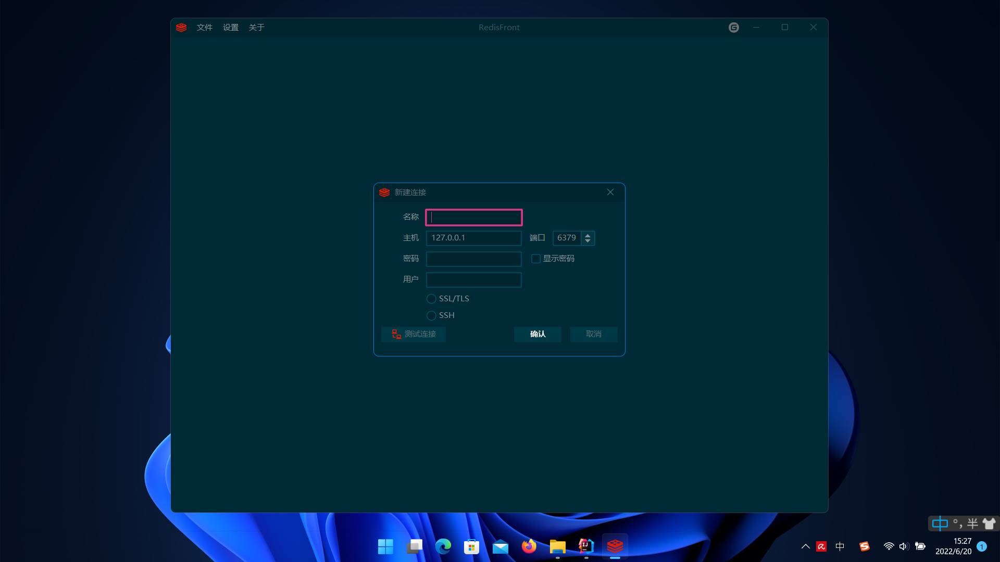
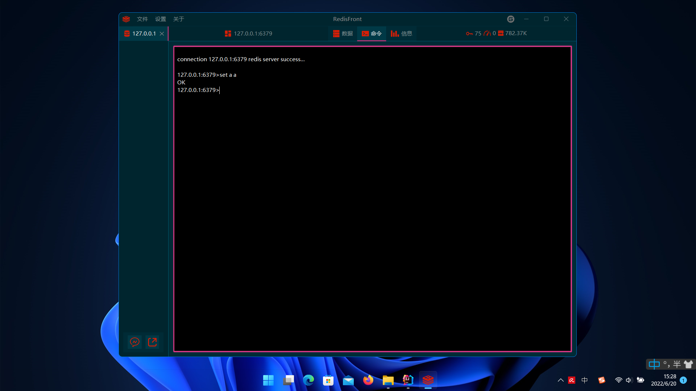

# Redis-Front

#### 介绍
基于Java Swing 开发的 Redis 桌面客户端
#### 截图

#### 打包

###### JRE
%JAVA_HOME%/jlink.exe --module-path jmods --add-modules java.desktop,java.prefs,java.base,java.logging,java.sql,java.naming --output jre
