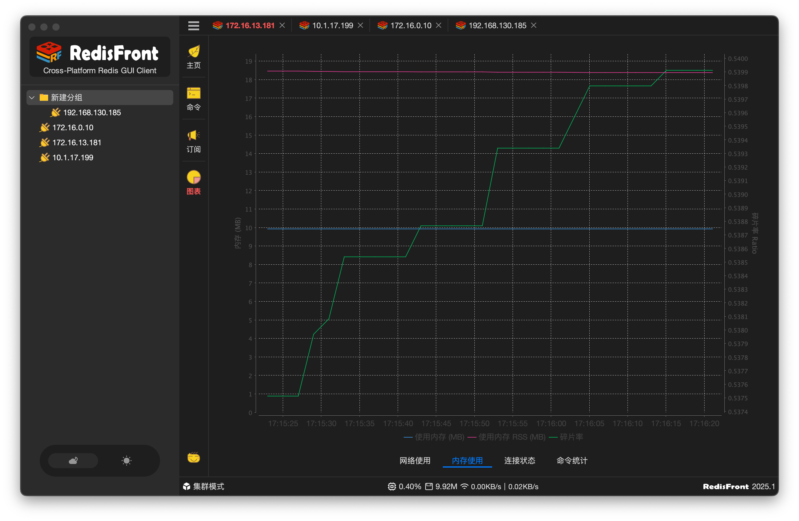

#   RedisFront - Cross-platform redis GUI

-------

RedisFront 是一款基于 Java Swing 开发的跨平台 Redis 客户端工具，兼容多种主流操作系统 ( 包括 Windows, macOS 和 Linux ) , 通过可视化界面实现 Redis 数据管理与服务器状态监测，适用于开发调试与生产运维场景。

* **多模式支持**：无缝对接单机部署、集群架构、哨兵模式等不同 Redis 部署形态，满足多样化环境需求

* **安全连接**：内置 SSH 隧道功能，保障远程访问 Redis 服务时的数据传输安全性

* **数据管理**：提供键值浏览、增删改查、过期时间设置、导入导出等完整数据操作功能

* **状态监控**：实时展示内存用量、连接数、命令统计等关键指标，辅助性能优化

[>> Click here to "README.md" with English!](./README_EN.md)

### 🌱 下载

[https://gitcode.com/dromara/RedisFront/releases](https://gitcode.com/dromara/RedisFront/releases)

[https://gitee.com/dromara/RedisFront/releases](https://gitee.com/dromara/RedisFront/releases)

[https://github.com/dromara/RedisFront/releases](https://github.com/dromara/RedisFront/releases)

### ⛳ 反馈

- 微信 `capf4xj`

- QQ群 `579454329` `验证信息：RedisFront`

### ❤️ 感谢
* [FlatLaf](https://github.com/JFormDesigner/FlatLaf?from=RedisFront)
* [Lettuce](https://github.com/lettuce-io/lettuce-core?from=RedisFront)
* [Hutool](https://hutool.cn?from=RedisFront)
* [JetBrains](https://www.jetbrains.com?from=RedisFront)

