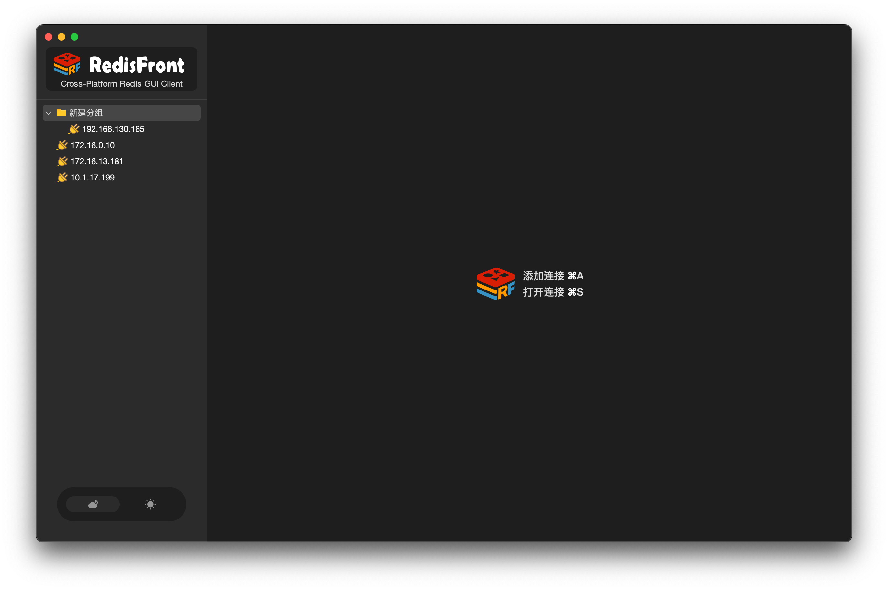
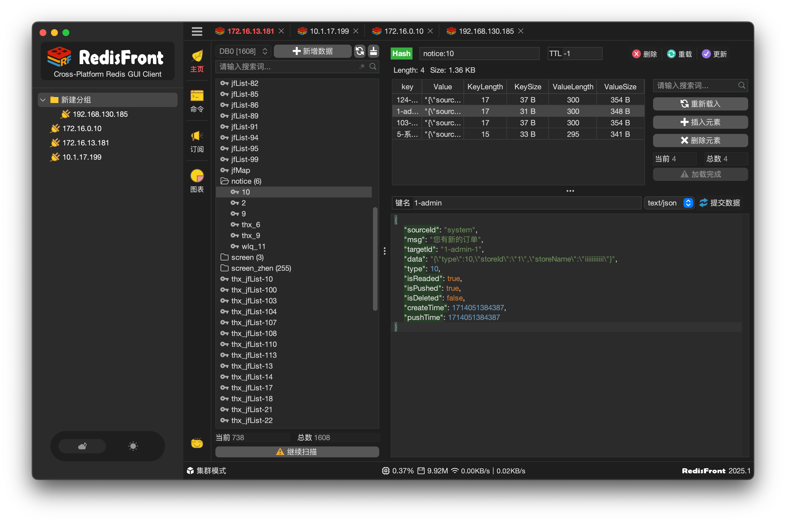

#   RedisFront - Cross-platform redis GUI

-------

RedisFront is a cross-platform Redis client tool developed with Java Swing, compatible with major operating systems (Windows, macOS,Linux). Its visualized interface enables Redis data management and server monitoring, suitable for development debugging and production operations.

* **Multi-mode Support**: Seamlessly connects to standalone deployments, Cluster mode, and Sentinel mode configurations

* **Secure Connectivity**: Built-in SSH tunneling ensures secure data transmission for remote Redis access

* **Data Operations**: Offers complete key-value management including CRUD, TTL settings, and import/export functions

* **Real-time Monitoring**: Displays critical metrics like memory usage, connection counts, and command statistics for performance optimization

### 🌱 Download

[https://gitcode.com/dromara/RedisFront/releases](https://gitcode.com/dromara/RedisFront/releases)

[https://gitee.com/dromara/RedisFront/releases](https://gitee.com/dromara/RedisFront/releases)

[https://github.com/dromara/RedisFront/releases](https://github.com/dromara/RedisFront/releases)

### ❤️ Thanks
* [FlatLaf](https://github.com/JFormDesigner/FlatLaf?from=RedisFront)
* [Lettuce](https://github.com/lettuce-io/lettuce-core?from=RedisFront)
* [Hutool](https://hutool.cn?from=RedisFront)
* [JetBrains](https://www.jetbrains.com?from=RedisFront)

